# Box

推箱子小游戏？？？

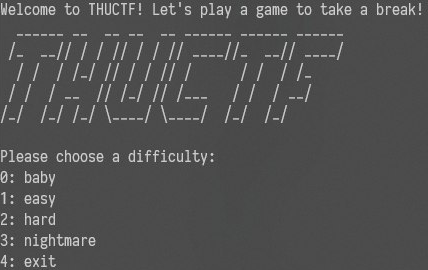

共 40 关，4 个难度，每一关代表 Flag 的一个字符，要获得 Flag 就需要打通 39 关（反正 Flag 的最后一个字符都已知了就不用打了）

我们可以来看每个难度的第一关，对难度有所了解：

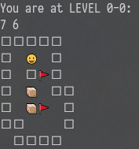

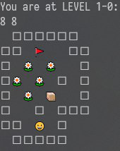

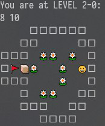

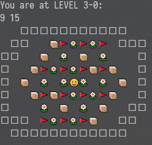

首先 Baby、Easy、Hard 都可以手推！使用[辅助工具](http://sokoban.cn/sokoplayer/SokoPlayer_HTML5.php) 可以更方便得进行手推。一般来说推的步数都在三位数，但真正推动箱子的次数其实很少，所以工作量并不大。然而到了 Nightmare 难度就……

于是尝试寻找工具，但未果。那么我们就运用下社会工程学的方法手推 Nightmare 难度关卡！

刚刚那个辅助的 HTML5 其实是来自于一个[国内 Sokoban 论坛](http://sokoban.cn/)，看到首页那个 QQ 群二维码了吗？加入群就可以装萌新提问啦！

于是我把 3-0 的关卡丢了过去，在大佬的帮助下顺利解开了：

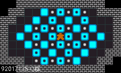

以及忽悠大佬给解关器：

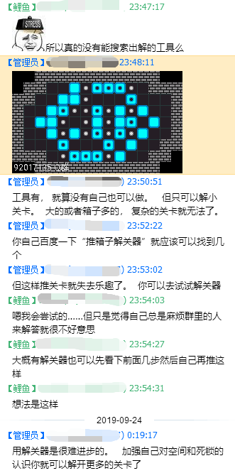

在百度和论坛的帮助下找到了 [Wiki](http://sokobano.de/wiki/index.php?title=Solver_Statistics)，发现了四种工具，其中最厉害的属 Sokolution。下载完后，出解出得那叫一个飞快！（即便这样，3-3 3-4 3-5 这种一看就是可以手玩的我就没跑工具了……）

但事情并没有那么顺利，工具最后还是卡在了 3-6……

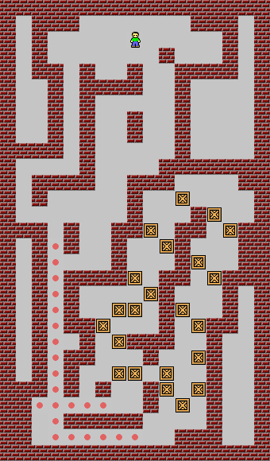

那既然大佬能手玩，那我也来尝试下！

其实这一关思路特别清晰，就是把箱子往上推，地图上面那一片空间就是用来暂时搁置箱子的，然后再把箱子往下推。关键在于怎么打通下面这一条回路。首先可以这么搞：

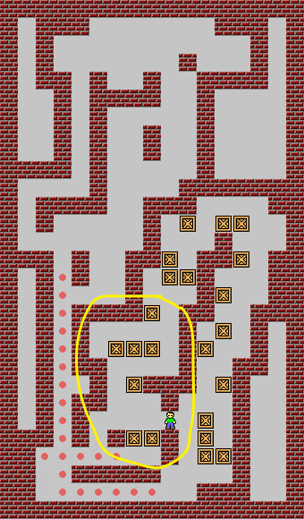

这样黄圈内的箱子都能推到上面空地去了，然后接着这个不是还没通路嘛，接着尝试打通，从右边推一个箱子到左边暂存，再从右上推一个箱子下去：

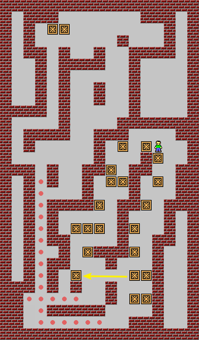

对于环路上面的则这样处理：

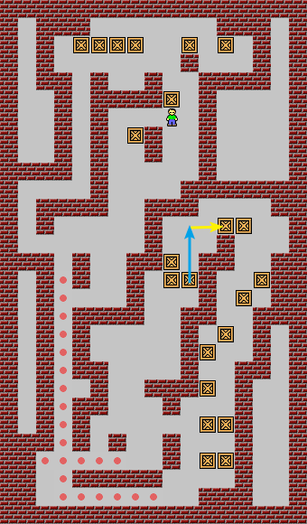

这下就全通了！然后就是把箱子分散放：

剩余的工作就很简单了，但非常枯燥，于是就丢给 Sokolution 去算，复制粘贴拼接一下就好了。解决！总计 5429 步，推动箱子 1334 次，移动指令长到要分两次输入（输入缓冲区大小好像只有 4096）。

接下来是 3-7：

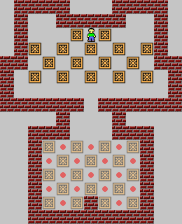

这个也太容易了……先让人走出来：

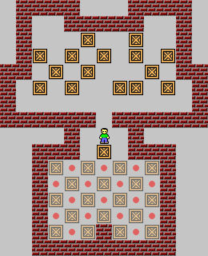

整理下下面的箱子：

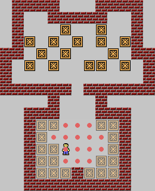

然后把左上边的箱子一个个推到下面：

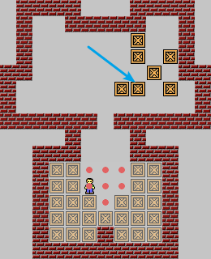

然后把右上边的箱子也一个个推到下面（蓝箭头标注的是第一个处理的箱子），就结束了！

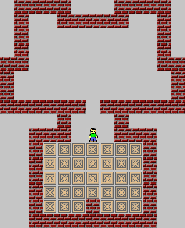

最后一关，3-8！

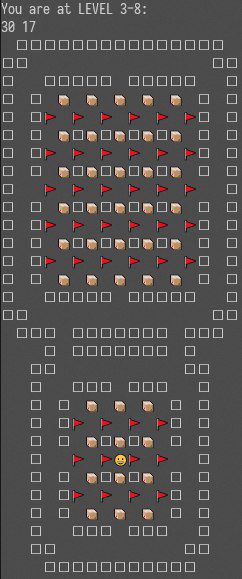

解决方案：分成上下两个子图，丢进 Sokolution 秒出解，然后合并即可。

到这里，Flag 就已经出来了！愉快地结束了推箱子之旅！

感谢强无敌的推箱子 QQ 群管理员，他甚至还找到了 3-6 的原题：

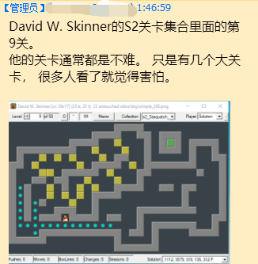

从 [Wiki](http://sokobano.de/wiki/index.php?title=Solver_Statistics_-_Sasquatch_II_-_David_W._Skinner) 上可以看到 3-6 只能用 JSoko 才能跑出解。

自己也发现 3-8 出自 David W. Skinner 的 S3 关卡集合里面的第 30 关，所需工具 Takaken。

3-9 出自 David W. Skinner 的 S6 关卡集合里面的第 40 关，从 [Wiki](http://sokobano.de/wiki/index.php?title=Solver_Statistics_-_Sasquatch_VI_-_David_W._Skinner) 可知其无工具可解。

以及花了半小时也把 3-9 手玩出来了，不难.jpg

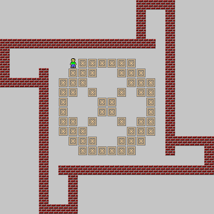

3-9 的思路就直接去看 [box.txt](./box.txt) 吧，所有解都在里面。