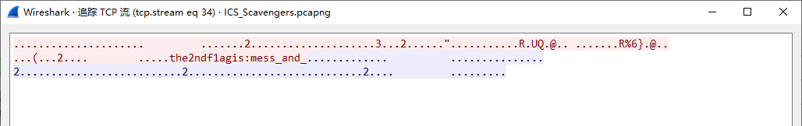

# ICS Scavengers

*I heard that ICS protocols like "MMS，S7comm and Modbus" are called as "The big, the bad and the fickle" in this game. ICS Scavengers, assemble!*

-----

把 `ICS_Scavengers.pcapng` 导入到 Wireshark 后开始追踪 TCP 流。

在流 0 能搜索到 `flag` 的文本，其位于 PRES 协议的包内，但是大部分都是 `flag.txt`，还有一个 `flag{wrong}`，并不能找到有用的线索。

接着是流 1，大多都是 MMS 协议，同样无发现。

然后是流 2，Modbus 协议，发现一处有趣的东西：

中间这个看起来很像 base64 啊，整理得到 `dGhlIGxhdHRlciBoYWxmIG9mIGZMQGcgaXMgcGxheV93aXRoX3dpcmVzaGFya30=`，base64 解密得 `the latter half of fL@g is play_with_wireshark}`，获得后半截的 Flag。

然后一个个流找，找到流 34 的时候又有新发现：

获得 Flag 的中间部分。

然后检查错误数据包，因为直接找流会漏掉一些错误数据包。发现了一个 Length=10876 的数据包显得特别异常：

下面这个不就是 base64 过的 jpg 文件么？还原下：

这三部分凑齐便可得到 Flag。