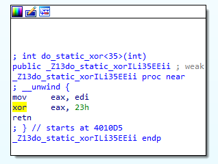

# Mingology

*我不要你觉着这是misc，我要我觉着*

*Hint: What do you think about the XOR instruction?*

-----

用 IDA 打开 Mingology，看到了一连串 do_static_xor 操作，从 0 到 511：

每个函数的功能都是进行 xor 操作，十分简单：

所以这到底意味着什么呢？

这时候我们调整到 Hex View 窗口，观察一连串 XOR 函数的代码，会发现其中 XOR 指令一会 35 开头一会 81 开头，且并没有什么规律。

猜想其隐藏了一定的信息，于是复制并将两种指令转化成 01 序列。经过多次尝试之后，其解码方式应为每八个为一组进行前后翻转后解码成 ASCII 字符，便可得到 Flag。