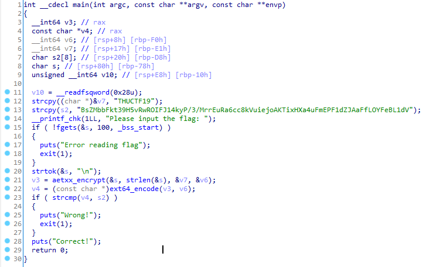

# Auth

*Authentication never made so easy.*

-----

首先反编译 `auth`，得到主程序：

观察可知其主要逻辑为先读入一个 Flag，然后经过 aetxx_encrypt 和 ext64_encode 得到一个密文，再将这个密文和图内的 s2 进行比较。从而可以知道 s2 便是正确的 Flag 经过加密后的密文。

首先逆向密文，也就是 base64 解码，但程序里的 base64 table 和标准的 base64 table 是不同的。

然后其实接着把 aetxx_encrypt 逆向出来，然后一步步倒着做，就好了。就是这么暴力……

（后来好像说这是 xxtea 加密算法来着……

