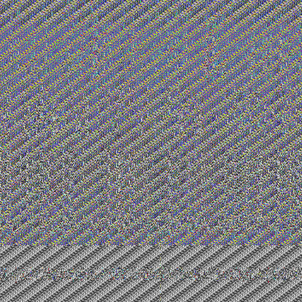
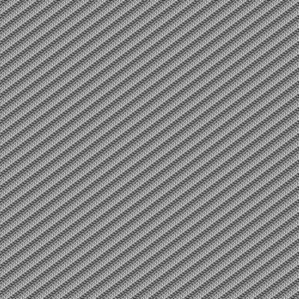
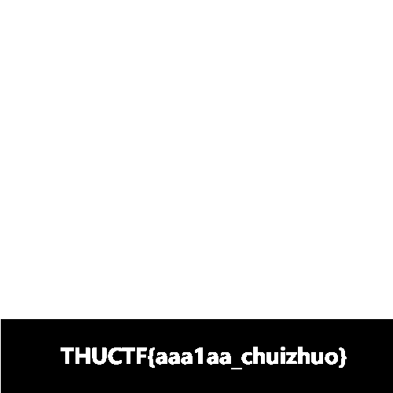

# NoCode

*No Code, No Reverse.*

-----

解压完得到一张图片和一个 exe 文件：

感觉 Flag 就在下面！

直接运行 `nocode.exe`，会发现其作用为将一张图加密混淆并输出。同时还附有一句话：

*THUCTF NoCode: Do not try to reverse me.*

？那我就不逆向了，试试黑箱。假如我拿一张纯黑的图作为输入，则会得到：

根据这图初步判定藏有 Flag 的图的下面是黑色背景。

然后再手动构造一些图，例如一列黑其余白的图，和一行黑其余白的图，根据其加密后的结构大胆猜测其加密共分为两个步骤：先列混淆，然后再对每个像素根据位置进行颜色混淆。

列混淆这好办，不就是个置换嘛。还是纯黑图，写个 Python 枚举白色列的位置，丢进 exe 跑，然后将得到的图和原来纯黑加密后的图进行比较，看看哪一列不同，这一列就是原先白色列经过列混淆后所在的位置。

然后得到所有列的位置对应后，对藏有 Flag 的图进行逆列混淆，再和纯黑加密图进行比较，就可以得到 Flag 了。

（后来知道 `nocode.exe` 居然是将图片上传至服务器处理了……）